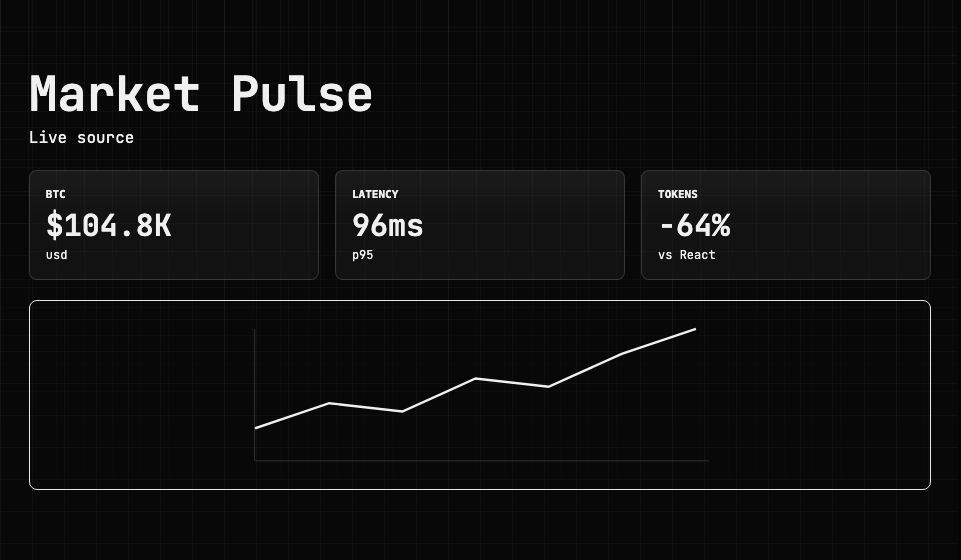

# LensUI

LensUI is a token-efficient generative UI runtime for agents. It renders compact lightcode and command streams into live browser UI, while staying agnostic to voice, auth, billing, memory, model providers, and host capabilities.

[Docs](https://lens.ardabot.ai) · [GitHub](https://github.com/ardabotai/lensui) · [npm](https://www.npmjs.com/package/@ardabot/lensui)

The framework is designed for agents that should show visual answers without sending HTML, JSX, Tailwind classes, CSS, D3 calls, Three.js scenes, or arbitrary JavaScript on every turn. The agent sends semantic UI lightcode; the renderer owns the DOM, layout fitting, component lifecycle, media handling, and live source updates.

The built-in renderer favors compact semantic components over repeated markup. High-leverage surfaces such as timelines, comparisons, source strips, steps, memory readbacks, media mosaics, tables, news lists, and media rails accept `items=` rows using `^` for cells and `;` for rows, so models can compose rich UI with a handful of lines.

## npm Package

`@ardabot/lensui` is the single public npm package for LensUI. It includes the lightcode parser, browser DOM renderer, command stream client, optional MCP/BYOK helpers, local loopback bridge, global browser bundle, and canonical agent skill.

Subpath exports:

- `@ardabot/lensui/core` - parser, command stream parser, component registry, workspace state, metadata extraction, and shared types.
- `@ardabot/lensui/html` - browser DOM renderer, built-in components, source updates, lifecycle hooks, and `window.lensStage`.
- `@ardabot/lensui/client` - optional WebSocket client for receiving command streams from a host.
- `@ardabot/lensui/mcp-server` - optional session-bound MCP bridge for applying lightcode to connected clients.
- `@ardabot/lensui/byok` - optional local/dev BYOK inference adapter. This is not part of core rendering.
- `@ardabot/lensui/bridge` - local loopback bridge that lets coding agents send lightcode into a live browser LensUI container, plus filesystem registry helpers for local hosts.
- `@ardabot/lensui/skill` - packaged agent instructions for generating and repairing LensUI lightcode.

LensUI core and HTML packages contain no provider SDKs, auth, billing, memory, voice, WebKit, or host tool code.

## Quick Start

Install the browser runtime into a host app:

```sh
npm install @ardabot/lensui
```

`pnpm add @ardabot/lensui`, `yarn add @ardabot/lensui`, and `bun add @ardabot/lensui` work too.

Mount a runtime and render compact lightcode:

```ts
import { createPersistentStageRuntime } from "@ardabot/lensui/html";

const root = document.querySelector<HTMLElement>("#lens-stage-mount");
const stage = createPersistentStageRuntime(root!);

stage.setSource("markets", { bitcoin: { usd: 76448 }, ethereum: { usd: 2098 } });

stage.render(`0DS|markets|https://api.coingecko.com/api/v3/simple/price?ids=bitcoin,ethereum&vs_currencies=usd|ttl=30|mode=poll
0F|st=mono|mode=dark
0V|Market Pulse|Live source
1G|auto|min=180|max=3
2M|BTC|$markets.bitcoin.usd|usd
2M|ETH|$markets.ethereum.usd|usd
2M|Tokens|-64%|vs React
1H|line|4,7,6,10,9,13,16|trend|h=190`);
```

Rendered by the browser runtime:



For script-tag usage, copy or serve `node_modules/@ardabot/lensui/dist/lensui.stage.global.js`, add `<div id="lens-stage-mount"></div>`, and call `window.lensStage.render(...)`. Fixed app surfaces can use the default `stage` sizing; iframe/card embeds can opt into content-driven sizing with `<div id="lens-stage-mount" data-lens-sizing="auto"></div>`.

For agents, run `npx -y --package @ardabot/lensui@latest lensui skill` or use [`skills/lensui/SKILL.md`](./skills/lensui/SKILL.md) as the canonical instruction source for lightcode, LightStyle, compact rows, patching, and component repair.

`createPersistentStageRuntime` loads and saves the component/style registry in `localStorage` by default. That lets agents save a component once, then refer to it by name in later renders instead of resending full HTML, CSS, or JavaScript. Browser hosts can pass a custom key with `createPersistentStageRuntime(root, { persistence: { key: "my-app:lensui" } })`. Native or Node adapters can persist the same `LensUISavedRegistry` shape to local files; `@ardabot/lensui/bridge` exports `loadRegistryFromFile` and `saveRegistryToFile` for local filesystem hosts.

## Live Agent Demo

The docs demo can generate a scoped `lensID` and secret token for one LensUI container. Run the local bridge, then paste the generated prompt into Claude Code or another local coding agent:

```sh
npx -y --package @ardabot/lensui@latest lensui bridge --port 5743
```

The browser connects out to `http://127.0.0.1:5743`, and the agent posts compact lightcode back to that same local bridge:

```sh
curl -X POST http://127.0.0.1:5743/lens/<lensID>/render \
  -H "authorization: Bearer <token>" \
  -H "content-type: application/json" \
  --data '{"lightcode":"0F|st=mono\n0V|Hello from your agent"}'
```

Use `npx -y --package @ardabot/lensui@latest lensui skill` to print the LensUI agent skill from the npm package. The bridge binds to loopback by default, requires the per-container token, and routes only to browser containers that have already opened the matching event stream.

The bridge has two write endpoints:

- `POST /lens/:lensID/render` with `{ "lightcode": "..." }` for ordinary semantic renders.
- `POST /lens/:lensID/apply` with `{ "commandStream": "..." }` for patches, saved components, saved styles, source updates, and page actions.

Command streams start with `!`. Block commands continue until a lone `.`:

```text
!
@!|CanvasPanel|html|agent-generated
<div><canvas></canvas><script>/* custom component code */</script></div>
.
R
0F|st=studio
0V|Custom UI|Saved component
1CanvasPanel
.
```

`/render` and `/apply` returning `200` means the bridge delivered the message to a connected browser. If the browser target is not open or the token is stale, the bridge returns `No connected LensUI container for that lensID/token.`

From this repository:

```sh
pnpm install
pnpm build
pnpm build:site
pnpm bench
pnpm test
pnpm coverage
pnpm e2e
```

When LensUI is vendored inside another app, run the same commands from the parent with `pnpm --dir LensUI ...`.

## Maintainer Release

The public runtime ships as one npm package named `@ardabot/lensui`:

```sh
pnpm build
pnpm pack:check
pnpm publish:npm
```

For npm accounts that require a one-time password:

```sh
pnpm publish:npm -- --otp 123456
```

Use `pnpm publish:npm -- --dry-run` to inspect the tarball without publishing.

The package is MIT licensed and host-neutral. The docs app and examples stay in the GitHub repo; runtime consumers normally install `@ardabot/lensui`.

## Browser Runtime

Build output:

```text
node_modules/@ardabot/lensui/dist/lensui.stage.global.js
```

Mount it in any browser app:

```html
<div id="lens-stage-mount"></div>
<script src="./dist/lensui.stage.global.js"></script>
<script>
  window.lensStage.render(`0F|0
0V|LensUI|Agent rendered UI
1G|auto|min=180|max=3
2M|Latency|182|ms|tone=success
2H|line|4,7,6,10|trend`);
</script>
```

Runtime sizing is host-declared on the mount element:

```html
<!-- Fixed app/TV/canvas surface. Content fits the box when possible and scrolls on overflow. -->
<div id="lens-stage-mount" data-lens-sizing="stage"></div>

<!-- Embedded/docs/card surface. Content keeps natural height and the host can resize around it. -->
<div id="lens-stage-mount" data-lens-sizing="auto"></div>
```

After each render, source update, or resize, the HTML runtime dispatches a bubbling `lensui:size` event from the mount. Hosts can use `detail.contentHeight` and `detail.contentWidth` to resize iframes or native containers. Agents and MCP bindings can also ask the runtime for the latest snapshot with `read("layout")` before sending a dense render:

```ts
root.addEventListener("lensui:size", (event) => {
  const { sizing, flow, contentHeight } = (event as CustomEvent).detail;
  if (sizing === "auto") iframe.style.height = `${contentHeight}px`;
  console.debug("LensUI layout", flow);
});

const layout = window.lensStage.read("layout");
```

The global runtime API:

```ts
interface LensStageRuntime {
  render(lightcode: string, components?: LensComponentDefinition[], styles?: LightStylePackDefinition[], defaultStyle?: string): LensApplyResult;
  apply(commandStream: string): LensApplyResult;
  patch(offset: number, deleteCount: number, lightcode: string): LensApplyResult;
  registerComponent(definition: LensComponentDefinition): LensApplyResult;
  patchComponent(name: string, offset: number, deleteCount: number, source: string): LensApplyResult;
  deleteComponent(name: string): LensApplyResult;
  registerStyle(definition: LightStylePackDefinition): LensApplyResult;
  patchStyle(name: string, offset: number, deleteCount: number, source: string): LensApplyResult;
  deleteStyle(name: string): LensApplyResult;
  setDefaultStyle(name?: string): LensApplyResult;
  setSource(id: string, payload: unknown): boolean;
  read(kind: "lightcode" | "components" | "styles" | "registry" | "metadata" | "status" | "layout"): unknown;
  loadRegistry(registry: LensUISavedRegistry): LensApplyResult;
  enablePersistence(options?: LensRegistryPersistenceOptions): LensStageRuntime;
  persistRegistry(options?: LensRegistryPersistenceOptions): void;
  clearPersistedRegistry(options?: LensRegistryPersistenceOptions): void;
}
```

## Lightcode And Commands

Lightcode is optimized for runtime token efficiency, not human readability.

```text
0DS|news|https://example.com/feed.json|ttl=600|mode=poll
0F|st=mono|f=mono|d=compact
0Y|panel|bg=card|bd=fg/28|p=4|r=2
0V|Brief|Live source
1M|Headline|$news.headline|source|s=panel
1NL|Latest||$news.items
```

Every render lightcode line starts with a base36 depth token. `0` is top level, `1` is the child level, `2` is the grandchild level, and so on. The depth token replaces indentation so the protocol keeps hierarchy without spending tokens on whitespace.

LensUI containers are designed to be screen-size and aspect-ratio agnostic. Agents should express layout intent with semantic containers such as `G|auto|min=180|max=3`; the browser runtime then collapses columns by the actual container width, prefers scrollable portrait flow on narrow screens, and only scales as a last resort. This keeps host experiences polished without making LensUI output depend on 16:9.

LightStyle lives in the same lightcode document. `0F` controls frame-level visual direction and can reference saved packs with `st=name`; `0Y` defines compact style recipes; nodes apply recipes with `s=name`. Built-in packs include `neutral`, `mono`, `studio`, `paper`, `gallery`, and `terminal`; each pack provides light and dark palettes and defaults to `mode=system`. Force a scheme only when needed with `0F|mode=light` or `0F|mode=dark`; palette-specific overrides use keys such as `light-bg=0,0,98` and `dark-bg=0,0,3`. LightStyle is semantic token data, not CSS. It styles UI chrome, typography, panels, charts, and renderer-owned accents only; source media, art, video, animation, canvas/WebGL art, and embedded web content keep original colors.

Command streams patch UI, components, and style packs without resending the whole stage:

```text
!
@!|KPI|a|g
0@|KPI|M|tone=success
.
Y!|mono-compact|g
0F|f=mono|d=compact|r=2|fx=grid
0Y|panel|bg=card|bd=fg/28|p=4|r=2
.
R
0F|st=mono-compact
0V|Market
1KPI|Cost|12|usd|s=panel
.
^|3|1
1KPI|Cost|14|usd
.
```

Live data transport is host-owned. A host can poll HTTP, subscribe over WebSocket/SSE, receive native app events, or proxy gateway updates, then push snapshots into the existing surface with `stage.setSource("id", payload)` or a command-stream source update:

```text
!
S|markets|application/json
{"btc":"$104.8K","trend":[4,7,6,10]}
.
```

Source updates re-resolve `$source.path` bindings in metrics, charts, lists, status rows, and other renderer-owned nodes without asking the agent to regenerate lightcode.

## Security Model

LensUI validates lightcode before committing render state. Failed renders leave the previous UI intact.

The uncomfortable part is real: LensUI can run agent-authored HTML, CSS, and JavaScript components. That is intentionally on by default because raw components are the path to maximum expressiveness. Treat those components like untrusted plugin code unless your host has reviewed or promoted them.

The renderer does not store provider tokens, does not perform billing, and does not own host permissions. Browser security boundaries, CSP, sandboxed iframes, isolated origins, approval hooks, component allowlists, and host-owned capability brokers are the right places to decide what a given app will accept. Keep secrets, billing, auth, and privileged effects out of frontend components; route sensitive actions through host APIs that can validate and confirm them.

Saved components are classified by trust level:

- `built-in`
- `user-saved`
- `agent-generated`
- `remote-imported`

JavaScript belongs in saved components, not ordinary render lightcode. Hosts can allow `html` or `react` components for rich custom behavior, but normal agent turns should instantiate those components by short name so token cost, cleanup, and patching stay manageable.

Hosts that need a stricter posture can pass `componentPolicy` to `createStageRuntime` or `createPersistentStageRuntime` to disable HTML components, scripts, inline event handlers, or style tags.

Provider inference should normally live in a host or gateway. The optional BYOK adapter is for local/dev/self-hosted use where the user intentionally supplies their own provider endpoint and token.

## Examples

- `examples/stage-template.html` - minimal stage fixture used by E2E tests.
- `examples/embedded-demo.html` - mount LensUI inside a normal app region, register a component, apply command streams, and update a live source.
- `apps/docs` - compact Next.js documentation app with Home, Specimens, and Demo routes. The proof surfaces use the real LensUI runtime where practical.
- `docs/benchmarks.json` - checked-in token-efficiency fixtures comparing equivalent React, HTML, and LensUI lightcode payloads.
- `skills/lensui/SKILL.md` - reusable agent skill for hosts that want models to generate LensUI lightcode.

## Development

```sh
pnpm install --frozen-lockfile
pnpm build
pnpm build:site
pnpm dev:site
pnpm typecheck
pnpm bench
pnpm test
pnpm coverage
pnpm e2e
```

`pnpm bench` estimates token savings for checked-in fixtures and fails when
average savings drop below the documented CI floor. The benchmark is transparent
and intentionally simple so protocol bloat is visible in review.

Coverage uses Vitest's V8 provider and writes text, JSON summary, and lcov
reports to `coverage/`. The current package-wide floor is 45% statements, 40%
branches, 50% functions, and 46% lines across `packages/*/src/**/*.ts`.

Host applications can copy `dist/lensui.stage.global.js` into their own app resources during packaging. LensUI itself remains host-agnostic.

## License

LensUI is MIT licensed.

Copyright (c) 2026 ArdaBot, Inc.
